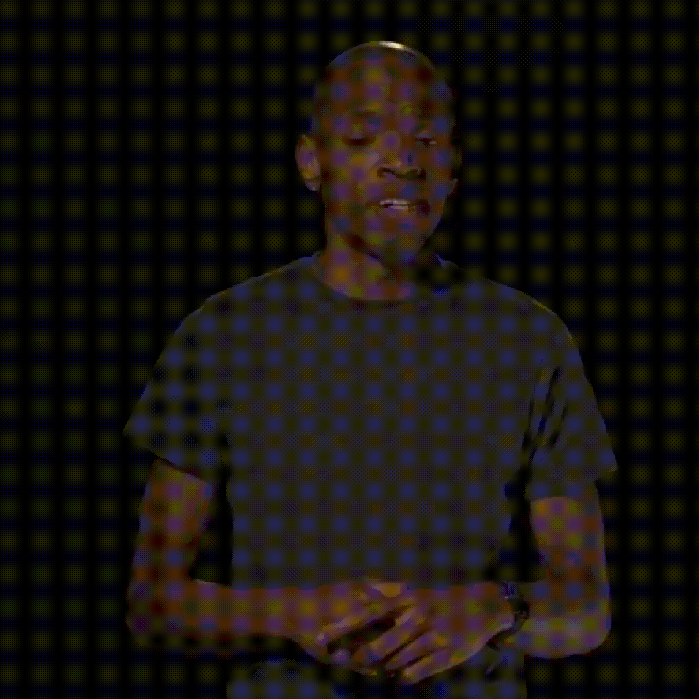

## Input-Aware Sparse Attention for Real-Time Co-Speech Video Generation
### [**Project**](https://beijia11.github.io/IASA/) | [**Paper**](https://arxiv.org/abs/2510.02617)


[Beijia Lu](https://beijia11.github.io/)<sup>1</sup>,
[Ziyi Chen](https://scholar.google.com/citations?user=4yMS3J8AAAAJ&hl=en)<sup>2</sup>,
[Jing Xiao](https://scholar.google.com/citations?user=mcBd8KUAAAAJ&hl=en)<sup>2</sup>,
[Jun-Yan Zhu](https://www.cs.cmu.edu/~junyanz/)<sup>1</sup>.  
Carnegie Mellon University<sup>1</sup>, PAII Inc<sup>2</sup>.
<br>**SIGGRAPH Asia 2025**  

We introduce a new conditional video distillation method for real-time co-speech video generation, by leveraging human pose conditioning for input-aware sparse attention and distillation loss.

## Results
### Comparison to Baselines
Our method generates more natural lip and hand animations than pose-driven baselines. Existing pose-driven methods often produce stiff or unnatural movements in these critical regions. In contrast, our model maintains high fidelity and realism, with lifelike facial and hand animations, while achieving significantly faster inference.


### Gallery
Given only a single static reference image and an input audio clip, our model effectively synthesizes highly realistic and expressive video outputs. These results visually demonstrate its capability to produce natural facial expressions, fluid body movements, and accurate lip synchronization in real time.
<div align="center">
  
  
  
  
  <br>
  
  
  
  
</div>


## Method


Our attention mechanism selectively focuses on tokens within salient body regions and their corresponding areas in temporally relevant frames.
(a) We first apply global masking, which restricts attention to the K most similar past frames based on pose similarity.
(b) Then local masking limits inter-frame attention to matched regions (e.g., faces, hands) to enhance temporal coherence.
(c) Our input-aware attention masking integrates both global and local masks to form an efficient and structured sparse attention pattern.

## Getting Started

### Environment Setup
1. Clone the repository and create conda environment:
```
git clone https://github.com/Beijia11/IASA.git
cd IASA
conda create -n IASA python=3.10
conda activate IASA
```
2. Install pytorch
```
# CUDA 11.8
pip install torch==2.5.0 torchvision==0.20.0 torchaudio==2.5.0 --index-url https://download.pytorch.org/whl/cu118
# CUDA 12.1
pip install torch==2.5.0 torchvision==0.20.0 torchaudio==2.5.0 --index-url https://download.pytorch.org/whl/cu121
# CUDA 12.4
pip install torch==2.5.0 torchvision==0.20.0 torchaudio==2.5.0 --index-url https://download.pytorch.org/whl/cu124
```
3. Make sure the submodule and requirements are installed:
```
pip install -r requirements.txt
git lfs install
git clone https://huggingface.co/H-Liu1997/emage_evaltools
```

### Dataset Preparation
You can download the dataset from the [link](`./static/data.txt`) provided.
After downloading, please place and organize the files into the following directory structure:
```
dataset/
├── audio/
│ ├── 00000_audio.wav
│ ├── 00001_audio.wav
│ ├── ...
│
├── images/
│ ├── 00000.png
│ ├── 00001.png
│ ├── ...
```

### Downloading Model Checkpoints
Our framework consists of two main components: **Audio-to-Motion** and **Motion-to-Video**.  
Please follow the instructions below to download and prepare the pretrained models.
Clone the pretrained audio-to-motion model from Hugging Face:

```
git clone https://huggingface.co/H-Liu1997/emage_audio
```
For the motion-to-video stage, we provide our implementation on DiT model.
```
pip install "huggingface_hub[cli]"
huggingface-cli download Wan-AI/Wan2.1-I2V-14B-720P --local-dir ./Wan2.1-I2V-14B-720P
```

### Inference
```
python infer_motion.py --visualization --audio_folder dataset/audio --save_folder dataset/pose
```
The code for input-aware attention applied to general conditional video generation will be released soon, stay tuned!


## Citation

If you find this repository useful for your research, please cite the following work.

```bibtex
@article{lu2025iasa,
  title={Input-Aware Sparse Attention for Real-Time Co-Speech Video Generation},
  author={Lu, Beijia and Chen, Ziyi and Xiao, Jing and Zhu, Jun-Yan},
  journal={ACM SIGGRAPH Asia},
  year={2025}
}
```

## Acknowledgements

We would like to thank Kangle Deng, Muyang Li, Sheng-Yu Wang, Maxwell Jones, Gaurav Parmar for their insightful feedback and input that contributed to the finished work. The project is partly supported by Ping An Research.

Our codebase is built upon several amazing repos: 
[EMAGE](https://github.com/PantoMatrix/PantoMatrix), 
[DiffSynth-Studio](https://github.com/modelscope/DiffSynth-Studio), and 
[UniAnimate-DiT](https://github.com/ali-vilab/UniAnimate-DiT).
